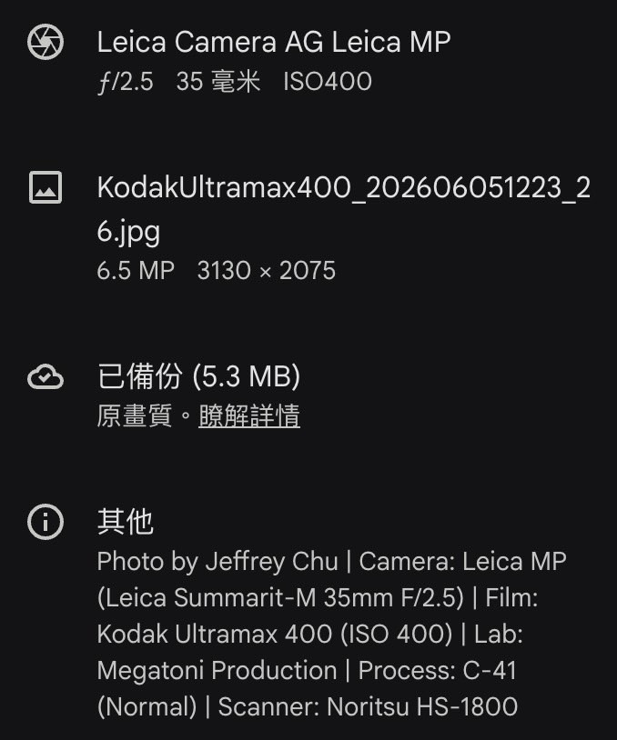
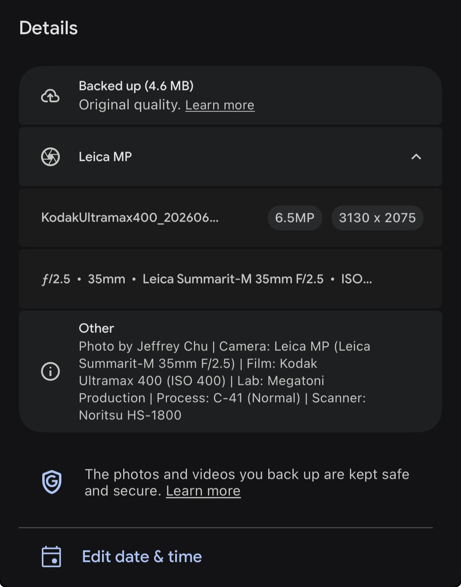
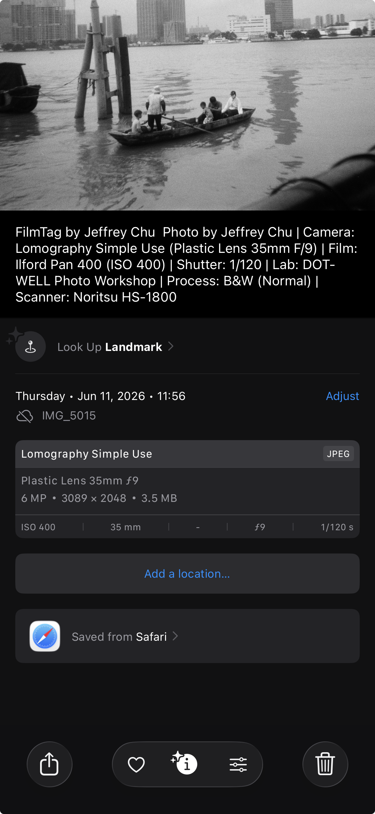
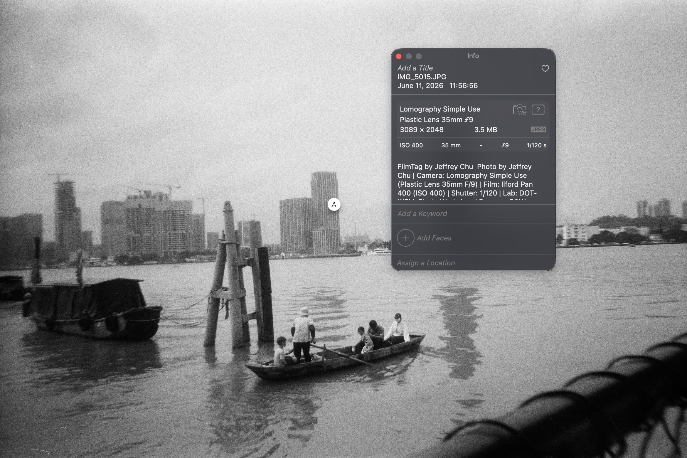

# FilmTag

幫菲林掃描檔批次寫入 EXIF 嘅互動網頁工具——全部喺瀏覽器入面完成。

**[filmtag.jeffreychuuu.com](https://filmtag.jeffreychuuu.com)**

> 🇭🇰 :uk: [English README](README.md)

## 點解要用 FilmTag？

啱啱拎返啲 scans——色水 perfect，grain 位靚到癲，你成個人都熱血緊。

跟住你打開 Google Photos，發現成卷菲林全部逼埋同一日——全部顯示係 lab scan 嗰日。三個禮拜前喺街頭影嘅 moody shot？同緊上星期二 dinner 相擺埋一齊。冇鬼用。

冇相機。冇鏡頭。冇日期。得個樣。

如果你係嗰種真係會 care 保持 analog 作品數位檔案整齊嘅人——你知呢種感覺有幾痴線。你用真金白銀買菲林、沖掃，結果拎返嚟嘅 JPEG metadata 空白到好似一個空嘅 Word 檔。

所以我整咗 **filmtag** 嚟解決呢個問題。

### 做咩嘅

Upload 你嘅 scans，揀你嘅 gear 同菲林，set 拍攝日期——佢會喺幾秒內 batch 注入完整 EXIF 資料。唔使手動編輯。唔使 Lightroom 偷雞。唔使試算表。

### 會寫入咩嘢

**EXIF：** Camera make/model、lens、ISO、focal length、aperture、shutter、date/time、GPS、artist、copyright、description  
**XMP：** Creator、credit、date created、label、description

### 你嘅設定，自動記低

預設係圍繞香港 🇭🇰 嚟設定——本地沖掃工作室如 Megatoni、DOT-WELL、TrueFare，同埋我嘅器材如 Leica MP 同 Olympus OM-2Sp。但全部都可以自訂。輸入任何你用嘅相機、鏡頭或 Lab，**filmtag** 會自動 save 落你瀏覽器嘅 local storage——下次開返就會喺 dropdown 見到。

有一點要留意：local storage 同你個瀏覽器綁死。清 browser data、轉瀏覽器、或者用私密模式，你嘅設定就會唔見。呢個取捨換嚟嘅係呢個工具完全 serverless——**你輸入嘅任何嘢、上傳嘅任何相，都唔會送去任何伺服器**。你啲相永遠留喺你部機度，就係咁簡單。

### 重點功能

| 功能 | 說明 |
|------|------|
| 📷 相機 & 鏡頭 | 內建 Leica MP、Olympus OM-2Sp 等，亦支援完全自訂相機型號、鏡頭焦距同最大光圈 |
| 🎞️ 底片 & ISO | 內建 23 款常見菲林（Kodak、Fujifilm、CineStill、Ilford 等），揀菲林會自動帶入 ISO |
| 🧪 沖掃紀錄 | 內建香港主流沖掃工作室：DOT-WELL、Megatoni、TrueFace Pro Lab 金鈿、Photo Garden 金藝、HK Camera、Showa、Colorluxe 彩圖麗——仲支援記錄 Push/Pull 同掃描器型號 |
| 🕐 時間排序（最正嗰個功能） | 每張相片自動遞增 1 分鐘，時區強制寫入 +08:00。一卷菲林跨唔同日子拍？可以分段設定日期同起始時間，Google Photos 就會完美排好順序 |
| 🌐 多語言 | 英文 & 繁體中文，透過浮動按鈕一鍵切換。所有介面文字均已翻譯 |
| 🗺️ GPS 拍攝位置 | 內建 Leaflet + OpenStreetMap 地圖。選擇檔案後搜尋地址或點擊地圖落針，GPS 坐標寫入 EXIF。逆向地理編碼顯示街道名稱喺每張檔旁邊 |
| ☑ Contact Sheet | 儲存或下載 ZIP 時自動生成 Contact Sheet — 可按 toggle 開關，支援獨立下載，底部 footer 顯示菲林/相機/lab/日期範圍 |

成品效果 👇

<table>
  <tr>
    <td align="center" width="25%"><b>Google Photos（網頁版）</b><br></td>
    <td align="center" width="25%"><b>Google Photos（手機版）</b><br></td>
    <td align="center" width="25%"><b>iPhone 相簿</b><br></td>
    <td align="center" width="25%"><b>Mac 相簿</b><br></td>
  </tr>
</table>

## 功能

- 支援拖放上傳 JPEG 相片
- 透過下拉選單設定相機、鏡頭、菲林、ISO、沖掃工作室、沖洗方式、Push/Pull、掃描器
- 支援多個日期分段，各自設定起始時間
- 處理前可預覽檔案重新命名摘要
- 寫入 EXIF 標籤：Make、Model、Artist、ISO、LensModel、DateTime、FocalLength、FNumber、Aperture、Shutter、UserComment、ImageDescription、Copyright、Instructions
- 寫入 XMP：Label、Creator、Credit、DateCreated、dc:description
- 批次下載為 ZIP，檔名標準化（`FilmName_YYYYMMDDHHMM_XX.jpg`）
- iOS：透過分享選單儲存至相簿
- 檔案縮圖預覽，點擊可放大睇原圖
- 多選檔案後點擊地圖批次設定 GPS 位置
- OpenStreetMap Nominatim 地名搜尋功能
- 可摺疊嘅起源與聲明區塊
- Contact Sheet：自動生成 JPEG 縮圖網格，底部 footer 顯示菲林、相機、鏡頭、lab、日期範圍 — 可 toggle 開關、獨立下載或隨 Save/ZIP 自動生成

## 技術

### 技術棧
- **piexifjs** — 瀏覽器端 EXIF 讀寫
- **JSZip** — 用戶端 ZIP 打包
- **esbuild** — 打包工具
- **Vercel** — 部署
- **Leaflet.js** — 互動地圖
- **OpenStreetMap + Nominatim** — 地圖圖磚、地理編碼／逆向地理編碼

### 專案結構

```
src/
  app.js            ← 主程式 (~249 行)：狀態初始化、事件綁定、模組接線
  i18n.js           ← 英文 & 繁體中文翻譯
  lib/
    utils.js        ← 純工具函數（toDms、injectXmp、esc、fmtSize…）
  modules/
    date.js         ← 日期設定、檔名生成
    gear.js         ← Gear 下拉選單、自訂選項、資料驗證
    gps.js          ← Leaflet 地圖、逆向地理編碼、位置
    process.js      ← ZIP/儲存處理、EXIF 注入
    ui.js           ← 檔案列表、摘要、縮圖、選擇、範圍
    upload.js       ← 檔案上傳 & EXIF 提取
  __tests__/        ← Vitest 測試套件（57 個測試）
    lib/utils.test.js
    modules/{date,gear,ui}.test.js
public/
  index.html        ← App 外殼，所有 UI 標記
data.json           ← 內建預設（相機、鏡頭、菲林、沖掃工作室）
```

### 測試

```bash
npm test              # 執行所有測試一次
npm run test:watch    # 監聽模式，適合 TDD
```

採用 **Vitest** + **happy-dom**。純工具函數（utils.js）同依賴狀態嘅模組邏輯（date、gear、ui）都已覆蓋。開發時建議先 run test 確保冇破壞現有功能。

## 本地開發

```bash
npm install
npm run build
npm run dev    # http://localhost:3333
```

## 部署

Push 上 GitHub → 喺 Vercel import → Root Directory = `.`（repo 根目錄）。Vercel 會自動執行 `npm run build`，serve `dist/`。

## 發佈流程

### 版本管理

本專案採用 semver。Source of truth 係 `package.json` → `version`。版號喺 build time 透過 esbuild `--define` 注入，顯示喺 app 底部。

### 步驟

1. 所有開發喺 `dev` branch 進行。Push 去睇 Vercel preview。
2. Ready 出街時：
   ```sh
   git checkout main
   git merge dev
   ```
3. 更新 README `## 新功能` — 喺 release entries 上面加返 version heading。
4. 執行 release script：
   ```sh
   npm run release
   ```
   會 bump patch version、commit、建立 git tag。
5. Push 觸發 Vercel production deploy：
   ```sh
   git push origin main --tags
   ```
6. （可選）去 GitHub → Releases → 由新 tag 建立 release，貼上 changelog entries。

### 版本類型

- `npm run release` → **patch** (1.1.3 → 1.1.4)
- `npm version minor` → **minor** (1.1.3 → 1.2.0)
- `npm version major` → **major** (1.1.3 → 2.0.0)

## 起源

起初只係寫咗個命令行工具俾自己同朋友用——我本身係菲林攝影入門者，咁啱又係做程式開發，純粹想有個方便嘅方法幫掃描檔加返相片資訊。後尾準備去旅行，驚沖掃舖喺旅行期間傳返啲掃描檔過嚟冇得整理，就索性整咗個網站出嚟，自己喺外地都處理得到。

## 聲明

呢個工具係免費分享俾菲林攝影愛好者嘅，絕不能用作商業用途或謀利用途，否則將追究法律責任。

---

© 2026 Jeffrey Chu. 版權所有，保留一切權利。

## 共用設定

`data.json` 定義所有下拉選單選項（相機、鏡頭、菲林、工作室、沖洗方式、Push/Pull、掃描器）。編輯呢個檔案就可以更新所有部署嘅選項。

## 許可證 (License)

本專案採用 **PolyForm Noncommercial License 1.0.0** 許可證。你可以自由非商業用途地使用、修改及分享，但嚴禁任何商業或謀利用途。詳情請參閱 `LICENSE` 檔案。

## 新功能
 
<details>
<summary>撳開嚟睇</summary>

**1.10.0 (2026-07-21)** — 每個欄位獨立 ⚙️ 圖示

- ⚙️ 每個下拉選單（Artist、Camera、Lens、Film、Lab、Process、Push/Pull、Scanner）嘅 label 隔籬都有 ⚙️ 圖示
- 🎯 撳 ⚙️ 直接打開自訂選項，自動展開對應 section — 直接管理該欄位嘅隱藏預設同自訂選項
- 📖 更新咗 tutorial 說明新嘅 per-field 操作方法
- 🧠 隱藏/顯示預設、刪除自訂選項全部可以喺同一個 overlay 搞掂

**1.9.0 (2026-07-20)** — 自訂選項：隱藏預設 + 管理已儲存

- ⚙️ Footer「自訂選項」打開 overlay 管理已儲存同內建嘅選項
- 👁️ 可以隱藏/顯示每個欄位嘅內建預設（相機、鏡頭、菲林、沖曬店等）
- 🗑️ 刪除自訂選項（artist、camera、lens、film、lab、process、push/pull、scanner）
- 🔄「顯示所有預設」一鍵恢復所有隱藏嘅選項
- 🔧 改完即時 refresh 下拉選單，唔使 reload

**1.8.0 (2026-07-20)** — 管理自訂選項

- ⚙️「管理」按鈕打開 overlay，可以檢視同刪除已儲存嘅自訂選項（artist、camera、lens、film、lab、process、push/pull、scanner）
- 🗑️ 每個選項都有刪除（✕）按鈕 — 改完即時 save 去 localStorage
- 🔄 刪除後自動 refresh 下拉選單，唔使 reload 頁面
- 👁️ 空白狀態提示話俾 user 知點樣加入自訂選項

**1.7.0 (2026-07-20)** — 編輯此卷按鈕

- ✏️「編輯此卷」按鈕喺「下一卷」隔籬 — 返回設定表格唔 reload，保留 upload 嘅檔案同所有設定
- 🎯 ZIP 下載、Content Sheet 下載、Gallery 畫面都會顯示
- 🧠 所有 in-memory state（檔案、GPS、日期、選擇）原封不動 — 改完設定可以再處理過

**1.6.0 (2026-07-20)** — EXIF 自動填入
- 🎯 上傳相片後自動讀取 EXIF，Artist、Camera、Lens、ISO、Process 自動填入對應欄位
- 🔍 將 EXIF 值匹配內建選項 — 匹配到就自動揀，匹配唔到就設為自訂值
- 📐 焦距同光圈值亦會從 EXIF 自動填入

**1.5.0 (2026-07-20)** — Contact Sheet 生成功能
- ☑ Review Summary 加入 Contact Sheet toggle — 預設開啟，自動 save 去 localStorage
- 📸「只生成 CS」按鈕 — 獨立下載 Contact Sheet
- 🎞️ 儲存相簿或下載 ZIP 時，如 toggle 開啟則自動生成 Contact Sheet
- 📐 動態網格 — canvas 尺寸跟 import 相片尺寸，自動計算最佳行列數，最多 40 張
- 📋 Footer：菲林 + ISO、相機 + 鏡頭、沖掃工作室、日期範圍

**1.4.0 (2026-06-29)** — 意見回饋系統 · 免責聲明 overlay · 教學 About 重組
- 💬 浮動意見回饋按鈕，支援 Bug Report / Suggestion 表格 — 提交至 Upstash KV
- ⚠️ 首次使用 overlay 而家需要 tick 2 個 checkbox（AI 工具確認 + 非商業用途同意）先可以繼續
- 📖 Origin 搬咗去教學 About tab 嘅第一步
- 🎯 浮動按鈕重新排序：🇭🇰 Language → ❓ Help → 💬 Feedback → 🐈 Easter egg

**1.3.0 (2026-06-29)** — 上次設定自動還原 · 教學 · 排序切換 · Range UX · 瀏覽計數
- 🔄 所有設定（gear、菲林、lab、沖洗方式、scanner、簽名）而家會喺下次開頁面時自動還原 — 唔使再逐個揀過
- 📖 第一次用嗰陣會自動 show 教學，之後可以㩒 ❓ button 隨時睇返 — 覆蓋上傳、gear、排序、日期、GPS、檢閱、EXIF 詳細、Google Photos 排序原理同私隱（所有資料只留喺 localStorage，唔會上 server）
- 🔤 排序按鈕簡化為單一切換 — ▼ A→Z / ▲ Z→A
- 🤚 Drag & drop 係唯一排序方法（▲/▼ button 已移除）
- ✅ 完成處理時 spinner 會變 tick icon
- 📄 拖到分頁最底會插入該頁最後位置，唔係全卷最尾
- 🛠️ 還原設定時優先 match dropdown 選項，唔係直接 set __custom__
- ✕ 範圍刪除按鈕只在多個範圍時顯示
- 🚫 全選時 Add Range 按鈕會 disabled
- 👁 瀏覽次數 & 🖼 已處理相片數量顯示喺 header（經 Upstash KV 儲存）

**1.2.0 (2026-06-28)** — 沖洗方式自訂輸入 + ZIP 下載後 Next Roll + 檔案排序
- ✏️ 沖洗方式而家支援自訂輸入 — 可以自由輸入任何沖洗方式（C-41、ECN-2、E-6 等）
- 💾 自訂嘅沖洗方式會自動儲存到瀏覽器，下次開返會見到
- 🎞️ Download ZIP 完成後都會有「Next Roll 🎞️」制 — 唔使 reload 就可以開新一卷
- 🔼 Upload 完嘅檔案可以㩒 ▲/▼ 重新排序 — 控制 sequence number 同 timestamp 嘅次序
- 🤚 亦可以直接用 Drag & drop 拖到任何位置

**1.1.3 (2026-06-14)** — 修正 Add Range + Clear GPS 按鈕
- 🐛 修正：模組重構後「Add Range」按鈕失靈
- ✏️ 「Clear Selected GPS」改為「清除」並搬移到地圖下面
- 🖼️ 上傳限制為只接受 `.jpg` / `.jpeg`（TIFF/DNG/PNG 會被拒絕）

**1.1.2 (2026-06-14)** — 限制上傳只接受 JPEG
- 🖼️ 上傳過濾：只接受 `.jpg` / `.jpeg`；TIFF/DNG/PNG 會被拒絕並顯示警告
- 📝 File input `accept` 屬性 & UI 文字同步更新
- 🔧 `handleFiles` 而家會 reject 非 JPEG 檔案並顯示 status message

**1.1.1 (2026-06-14)** — 程式碼模組化、Vitest 57 個測試
- 🧩 `app.js` 由 1505 行拆為 6 個 modules（而家 249 行）
- 🧪 加入 Vitest + happy-dom 測試框架（57 個測試），支援 TDD
- 🏷️ 用字更新：「Author」全面改為「Artist」（code、DOM、data.json、翻譯）
- 🗂️ 專案重組：`lib/` 放工具函數，`modules/` 放邏輯
- 🐛 修正：範圍選擇 dropdown filter、Next Roll 按鈕、review summary 按鈕
- ⚠️ 免責聲明：撳 Disagree 後會封鎖頁面，需要 refresh 先用到

**1.0.1 (2026-06-14)** — README 重寫、版號顯示、發佈流程
- 📝 README 改寫：敘事式開場、HK presets、serverless 說明
- 🚀 App 底部顯示版號、Release Workflow 文件化
- 📦 更新日誌改用 details 摺疊 + version heading

**2026-06-12** — 預設日期改用檔案 modified time
- 🕐 冇 EXIF 拍攝日期時，改用第一張相嘅 `lastModified` 做基準，每張 +1 分鐘（唔再係硬食今日 12:00）
- 📍 GPS Save 制而家會 apply 地圖 marker 位置俾 selected files；冇 marker 時 disable
- 🎨 用字更新：「Author」→「Artist」、「file」→「photo / 相 / 菲林」

**2026-06-12** — Summary & Gallery 改為 modal overlay
- 📋 Review Summary 而家係 modal overlay，有 Close/Save/Download 按鈕
- 📸 處理完成後顯示 Gallery overlay —「Next Roll 🎞️」重置全部並 fade-out 捲回頁頂
- ⏳ Processing progress bar 而家係 modal overlay，顯示喺 summary 上面

**2026-06-12** — UI 翻新：日期/GPS modal & 操作按鈕
- 🎯 Select 檔案後顯示兩個操作按鈕：「設定日期時間」同「設定 GPS 位置」
- 📅 日期時間編輯搬去 modal overlay，有 Save/Cancel
- 🗺️ GPS 編輯搬去 modal overlay，有地圖、搜尋、Save/Cancel
- 🔲 Overlay 只可以由 Save/Cancel 關閉，唔會意外 backdrop dismiss

**2026-06-12** — 背景預載 & 順序載入
- ⚡ Thumbnail prefetch — page 1 thumbnail 完成後，背景 decode 之後嘅頁面（concurrency=2），切頁即時顯示
- ⚡ 順序啟動 — EXIF 提取先 run，完成後先開始 thumbnail generation，唔會爭 I/O
- ⏳ 上傳 loading overlay — block 畫面直到第一頁 EXIF + thumbnail ready，先 release 俾 user 操作
- 🐛 修正：上傳後 Review Summary 按鈕冇正常啟用

**2026-06-12** — 並行處理 & 地理編碼節流
- ⚡ Zip/Save 而家 4 張相同時處理，36 張加快約 3 倍
- 🗺️ Reverse geocode 限制 1 req/s + 快取重複座標，唔會再因為 rate limit 而 lost address
- 🖼️ Summary 縮圖同樣加入 concurrency limit

**2026-06-12** — 分頁顯示 & 縮圖快取
- 📄 檔案列表分頁 — default 每頁 5 張，可選 5/10/25/50/全部；上下頁切換
- 📋 Review Summary 分頁 — 檔案表格同樣支援分頁
- ⚡ 縮圖快取 — thumbnail 首次 render 後 cache 做 data URL；切頁後即時顯示唔使重新 decode
- 🗺️ 「清除已選 GPS 位置」按鈕搬去搜尋列獨立一行，UX 更清晰

**2026-06-12** — 大量上傳效能翻新
- ⚡ 批次 `renderFileList()` — 而家等所有 EXIF 讀完先 render 一次，唔會每張相都 rebuild 成個 list
- ⚡ 快取 byte-to-string 轉換 — 每張相喺 EXIF 提取時只轉一次，zip/save 時重用，唔使 loop 幾千萬次
- 🖼️ 縮圖生成加 concurrency limit — 最多同時 decode 6 張，唔會因為太多相而 freeze 瀏覽器
- 💨 Blob URL 記憶體管理 — 所有 `createObjectURL` 用完即 revoke，杜絕 memory leak

**2026-06-12** — Google AdSense 整合
- 📢 加入 AdSense script 同 meta tag 以便放送廣告
- 📄 網站根目錄放置 `ads.txt` 供廣告網絡驗證
- 🔧 Build script 更新，自動複製 `ads.txt` 到 dist/

**2026-06-11** — 相機-鏡頭關聯同儲存修正
- 📸 自訂鏡頭而家按相機儲存——每部相機只會顯示屬於佢嘅鏡頭
- 💾 焦距同最大光圈會同鏡頭名稱一齊儲存
- 🐛 修正：相機揀自訂時鏡頭資料冇儲存到 localStorage
- 🐛 修正：揀已儲存嘅自訂相機唔再令頁面 crash
- 🐛 修正：已儲存嘅自訂相機會顯示之前嘅鏡頭選項，而唔係空白

**2026-06-11** — GPS + 多語言更新
- 🌐 英文 & 繁體中文（香港），浮動按鈕一鍵切換，所有介面已翻譯
- 🗺️ GPS 拍攝位置 — Leaflet + OpenStreetMap 地圖，搜尋地址或點擊落針，坐標寫入 EXIF
- 📍 逆向地理編碼 — 設定位置後顯示街道名稱於每張檔旁邊
- 🖼️ 檔案縮圖預覽，點擊放大睇原圖
- 🔄 多選檔案批次設定 GPS 位置

**2026-06-11** — 檔案設定 + 日期時間 + 摘要檢視翻新
- 📅 日期時間合併入檔案設定區域 — 揀選檔案後更改日期時間即時生效
- 🗓️ 上傳時自動抽取 EXIF 內原有日期；無日期則預設今日 12:00
- 📍 上傳時自動抽取 EXIF 內 GPS 坐標，同時逆向地理編碼獲取地址
- 🧹 清除日期 / 清除已選 GPS 位置按鈕
- 📋 摘要檢視新增 40×40 縮圖、位置欄、日期欄
- 🏷️「在相片描述中加入 FilmTag 署名」選項取代舊簽名設定
</details>
